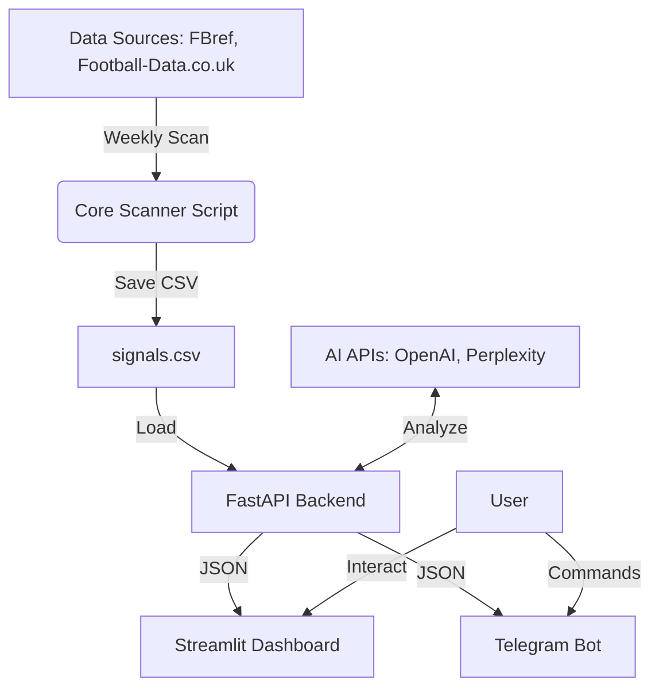

# Signalizer 3.5: Dashboard & Bot Implementation Guide

## 1. Архитектура Системы

Система состоит из трех основных модулей, работающих параллельно:

1. **Backend (FastAPI)**:
    * Выполняет тяжелые задачи: сканирование матчей, расчёт статистики, обращение к AI API.
    * Предоставляет JSON API для фронтенда и бота.
    * Запускается через `uvicorn`.

2. **Frontend (Streamlit)**:
    * Визуальный интерфейс для пользователя.
    * Отображает таблицы сигналов, графики ROI.
    * Инструмент "Express Editor" для ручной работы с экспрессами.
    * Инструмент "AI Analyzer" для аналитики.

3. **Telegram Bot (Aiogram)**:
    * Мобильный интерфейс.
    * Присылает уведомления.
    * Позволяет быстро получить топ сигналов.

### Диаграмма потоков данных



## 2. API Endpoints (FastAPI)

Файл: `app/main.py`

* `POST /scan/{days}`: Запустить сканер на указанное количество дней. Возвращает статус и количество найденных сигналов.
* `GET /signals`: Получить текущий список сигналов в JSON формате.
* `GET /backtest`: Получить результаты исторического тестирования (ROI, Winrate по лигам).
* `POST /analyze_express`: Отправить список матчей на анализ в AI (Perplexity/OpenAI).
* `GET /kelly`: Рассчитать критерий Келли для заданных коэффициентов и вероятности.

## 3. Функциональные Модули

### 3.1. Express Editor (Редактор Экспрессов)

Модуль в Streamlit для генерации систем из экспрессов "2 из 3" или обработки 27 вариантов (3 события * 3 исхода).

* **Вход**: 3 матча.
* **Логика**: Генерирует все возможные комбинации исходов (ТМ, ТБ, Чет/Нечет по запросу).
* **Swap Чет/Нечет**: Функция, автоматически меняющая исход на противоположный (чет <-> нечет) для хеджирования.

### 3.2. AI Analyzer

Интеграция с LLM для текстового обоснования ставок.

* **Prompt**: "Analyze these matches for Under 3.5 goals, considering team H2H and recent form..."
* **Source**: Perplexity (актуальные новости/травмы) + OpenAI (логический анализ).

### 3.3. Kelly Auto

Калькулятор размера ставки.

* Формула: `f* = (bp - q) / b`
  * `b` = коэффициент - 1
  * `p` = вероятность выигрыша (оценка модели)
  * `q` = вероятность проигрыша (1 - p)

## 4. Настройка Окружения

### Установка зависимостей

```bash
pip install pandas fastapi uvicorn streamlit aiogram soccerdata requests openai
```

### Структура проекта

```
project/
├── app/
│   ├── __init__.py
│   ├── main.py          # FastAPI backend
│   └── tg_bot.py        # Telegram bot
├── dashboard.py         # Streamlit frontend
├── under35_scanner.py   # Core logic
├── requirements.txt
└── .env                 # API keys (TG_TOKEN, OPENAI_API_KEY)
```

## 5. Deployment

### PythonAnywhere / Beget VPS

1. **FastAPI**: Запустить как фоновый процесс или через Systemd.
    `uvicorn app.main:app --host 0.0.0.0 --port 8000`
2. **Streamlit**: Запустить на отдельном порту.
    `streamlit run dashboard.py --server.port 8501`
3. **Bot**: Запустить polling.
    `python app/tg_bot.py`
4. **Cron**: Настроить ежедневный запуск сканера.
    `0 9 * * * /path/to/venv/bin/python /path/to/project/under35_scanner.py`

## 6. Quick Start Commands

Откройте 3 терминала и запустите компоненты:

**Terminal 1 (API):**

```bash
uvicorn app.main:app --reload
```

**Terminal 2 (Dashboard):**

```bash
streamlit run dashboard.py
```

**Terminal 3 (Bot):**

```bash
python app/tg_bot.py
```
